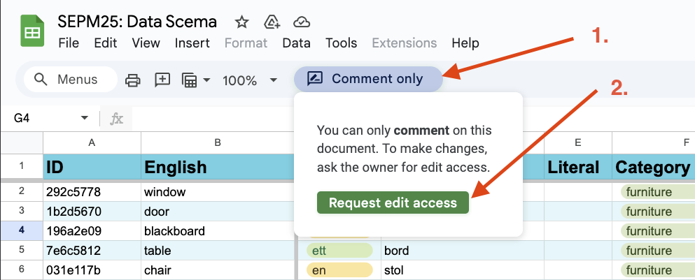
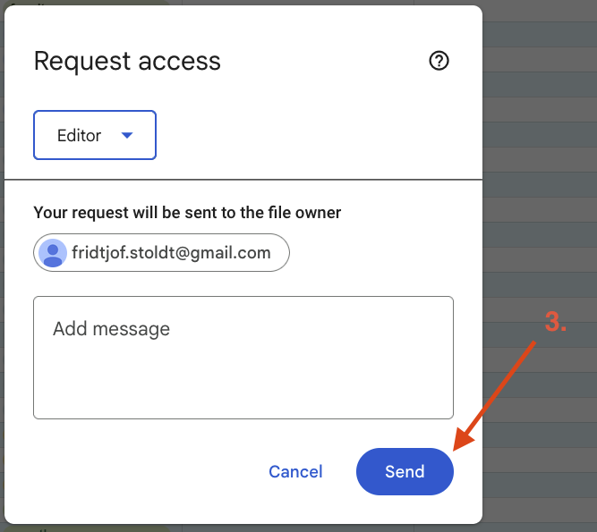

# Assets

## Updating the Vocabulary Database

This document explains how to add and manage vocabulary data and assets for the website.

The website supports two data sources:
1. Google Sheets (main method during the course)
2. Local JSON files (planned for release builds)

### Updating Data in Google Sheets

This section explains how to update the vocabulary database using Google Sheets

#### Request Access

1. Open the Google Sheets document: <https://docs.google.com/spreadsheets/d/1de16iRzmgSqWvTTxiNvQYM79sWJBwFJN0Up3Y0allDg/edit?usp=sharing>
2. Click on "Comment Only" and then "Request edit access"

    

3. Click **Send** to submit your request.

    

#### Adding new vocabulary

Each row on the sheet corresponds to one vocabulary. The following is a description of what data goes in each column:

| Column | Description |
|----|---|
| ID | Unique identifier. Copy the formula from an existing row to generate a hash. Avoid duplicates. |
| English | The vocabulary in English |
| Article | The article, or leave empty if none |
| Swedish | The vocabulary in Swedish |
| Swedish_plural | The vocabulary in Swedish |
| Literal | The literal representation of the vocabulary or empty |
| Category | The category this word belongs to |
| Image-url | URL of an image. Can be relative (/assets/images/<id>.png) or an external URL. Supported: PNG, JPG. |
| Image_copyright_info | Copyright information which might need to be displayed with the image for legal reasons. |
| Audio-url | URL of an audio file. Can be relative (/assets/audio/<id>.mp3) or an external URL. Supported: MP3, WAV. |

⚠️ Check license information before adding images or audio files. Most assets require attribution. Prefer making your own assets or using images from the public domain, which don't require attribution.

| ID       | English | Article | Swedish | Swedish_plural | Literal | Category  | Image_URL                | Image_copyright_info | Audio_URL               |
| -------- | ------- | ------- | ------- |--------------- | ------- | --------- | ------------------------ | -------------------- | ----------------------- |
| a1b2c3d4 | chair   | en      | stol    | stolar         |         | furniture | /assets/images/chair.png | "Standard chair modern" by <a href="https://commons.wikimedia.org/wiki/user:Pk0001">Pk0001</a> licensed under <a href="https://creativecommons.org/licenses/by-sa/4.0">CC BY-SA 4.0</a> | /assets/audio/chair.mp3 |

#### Access general data

The data is structured like a relational database, keyed by vocabulary ID. Use the provided API:

* `window.vocabulary.get_vocab(id)`: This returns the vocabulary metadata belonging to the given ID.

    Words usually have the following metadata:
    - `en`              The vocabulary in english
    - `sv`              The vocabulary in swedish
    - `sv_pl`           The plural of the vocabulary in swedish (Optional)
    - `article`         The article of the word (Optional)
    - `literal`         The literal representation of the word (Optional)
    - `img`             The URL of the image for this word (Optional)
    - `img_copyright`   The copyright information for this image if it needs to be displayed (Optional)
    - `audio`           The URL of the audio for this word (Optional)

* `window.vocabulary.get_category(category)`: Returns a list of vocabulary IDs belonging to the given category.

Getting the english word of the first furniture item would look like this:

```js
// Get all vocabulary belonging to the category `furniture`
const ids = window.vocabulary.get_category("furniture");
// Load the metadata for the first ID
const vocab = window.vocabulary.get_vocab(ids[0]);
// Access the `en` field
const english = vocab.en;
```

#### Adding team specific data

Each team has its own column in the sheet. Only edit your team’s column. The column can contain any string, such as:

Here are three possible examples:
* Team 17 might want to store a path to an image which is specific for their game. The data could look like this:

    `/team17/assets/image.png`

* Team 17 might need a description and an image which is specific to their game, then they could store a JSON string like this:

    `{"img": "/team17/assets/chair.png", "description": "something you can sit on"}`

* Team 17 might want to store a score for how difficult a word is. Then they can simply store a number to represent this:

    `12`

#### Access team specific data

Before accessing team specific metadata you need to load it into memory. For this you need to add the following call before the call to `window.vocabulary.when_ready`

```js
window.vocabulary.load_team_data(<team_number>); // Add this line
$(function() {window.vocabulary.when_ready(function () {
    // ...
})});
```

Once loaded you can use two main functions to access the data:

* `window.vocabulary.get_team_data_keys()`: This returns an array with the IDs of all vocabulary which has custom data for the loaded team.
* `window.vocabulary.get_team_data(id)`: This returns the data stored in the column of your team as a string. You can then process it as needed.

## Updating the local JSON

For faster loading and version control, the Google Sheets data can be exported as JSON.

1. Download the CSV from the Google Sheets document.
2. Save it as `words.csv` in the repository root.
3. Run `gen-vocab.py` from the root of the repository to update the files:
    ```
    python3 ./assets/gen-vocab.py
    ```
4. In `/scripts/vocabulary.js`, set:
    ```js
    const FETCH_EXTERNAL = false;
    ```

Done — the website now loads vocabulary from the local JSON files.

## Troubleshooting

* **New word not showing up?**

  Refresh the page or check for typos in the ID.

* **Invalid JSON in team column?**

  Ensure proper formatting (wrap keys/values in quotes).

* **Missing images/audio?**

  Verify the file path and that the file is committed to the repo.