<p align="center">
  
</p>

## Vad sa du? ( Say What?) (Swedish Vocabulary Game)

## Project Overview

This educational game targets exchange students wanting to learn Swedish and provides an engaging way to practice Swedish vocabulary recognition. Players listen to audio files and select the matching image from multiple options, reinforcing word-meaning associations.

## 📖 Table of Contents

- [Vad sa du? ( Say What?) (Swedish Vocabulary Game)](#vad-sa-du--say-what-swedish-vocabulary-game)
- [Project Overview](#project-overview)
- [📖 Table of Contents](#-table-of-contents)
- [Try It Yourself](#try-it-yourself)
- [📸 Screenshots](#-screenshots)
  - [Onboarding \& Navigation](#onboarding--navigation)
  - [Gameplay \& Feedback](#gameplay--feedback)
- [✨ Features](#-features)
- [🧠 How It Works](#-how-it-works)
  - [User Flow](#user-flow)
  - [⚒️ Architecture](#️-architecture)
    - [🖼️ Display Components](#️-display-components)
    - [⚙️ Data \& Logic Layer](#️-data--logic-layer)
- [🛠️ Tech Stack](#️-tech-stack)
- [🚀 Getting Started](#-getting-started)
- [🧪 Testing](#-testing)
  - [Test Coverage](#test-coverage)
- [🤝 Contributing](#-contributing)
  - [Guidelines](#guidelines)
  - [Future Development Opportunities](#future-development-opportunities)
- [📄 License](#-license)

---

## Try It Yourself

**Link :** [https://uu-semp.github.io/swedish-learning-app-2025/](https://uu-semp.github.io/swedish-learning-app-2025/)

---

## 📸 Screenshots

### Onboarding & Navigation

|                  Main Screen                   |                       Welcome                        |                        Tutorial                        |                        Settings                        |                    Category Select                     |
| :--------------------------------------------: | :--------------------------------------------------: | :----------------------------------------------------: | :----------------------------------------------------: | :----------------------------------------------------: |
| 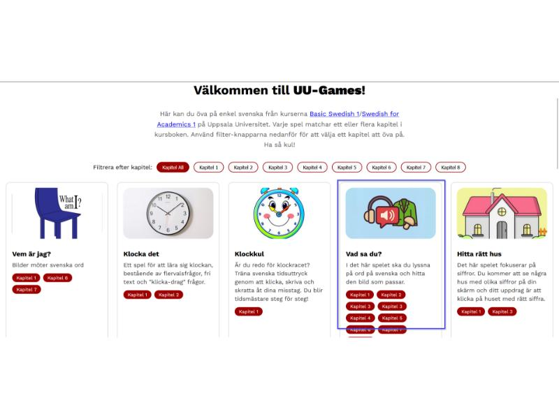 | 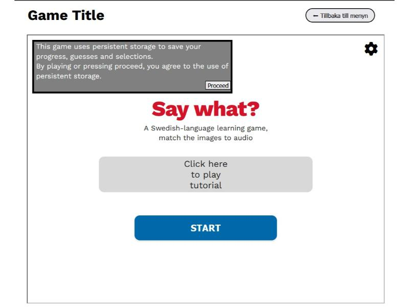 | 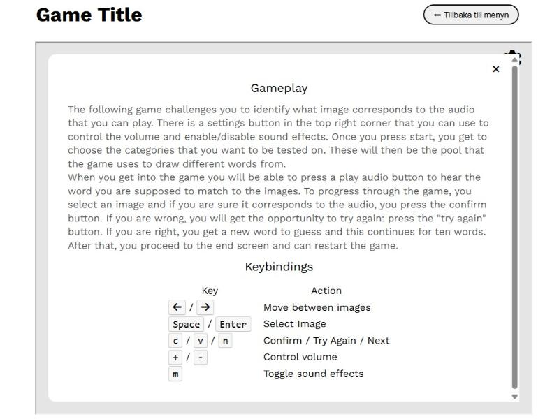 | 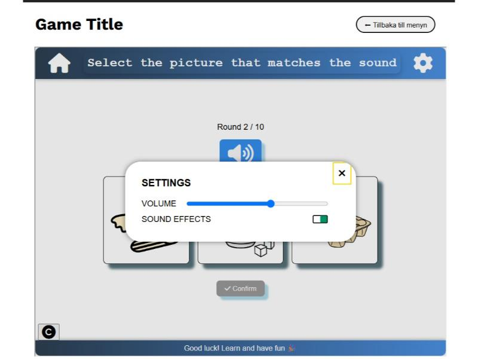 | 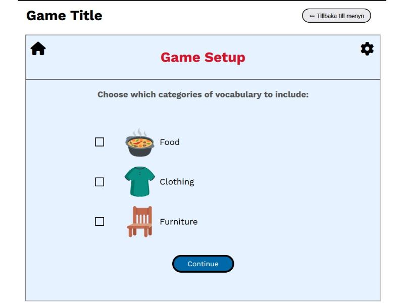 |

### Gameplay & Feedback

|                            Neutral                            |                      Correct Answer                       |                     Incorrect Answer                      |                           Scoreboard                            |                           Wordlist                           |
| :-----------------------------------------------------------: | :-------------------------------------------------------: | :-------------------------------------------------------: | :-------------------------------------------------------------: | :----------------------------------------------------------: |
| 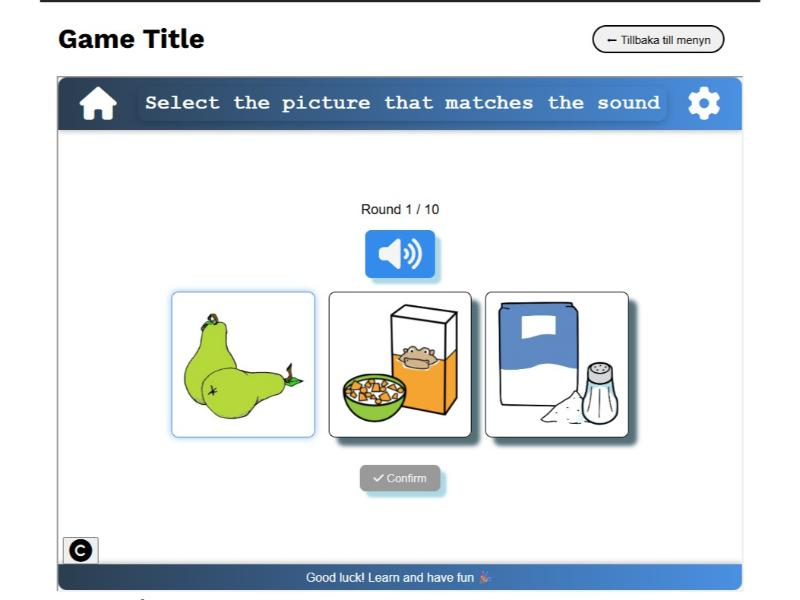 | 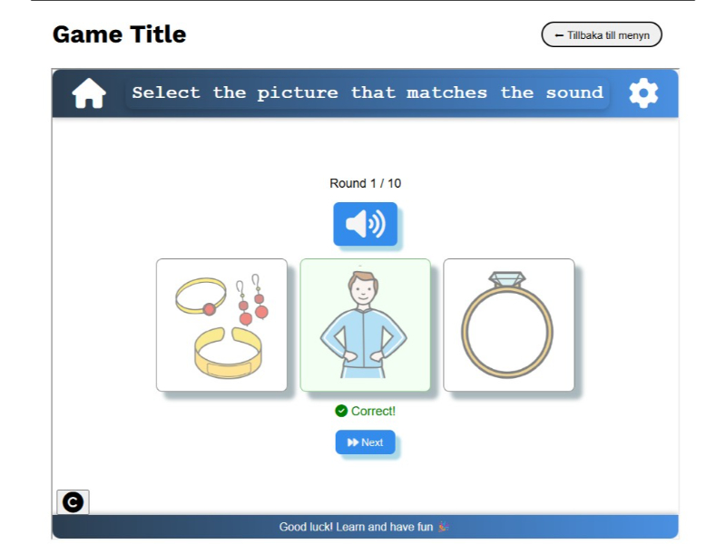 | 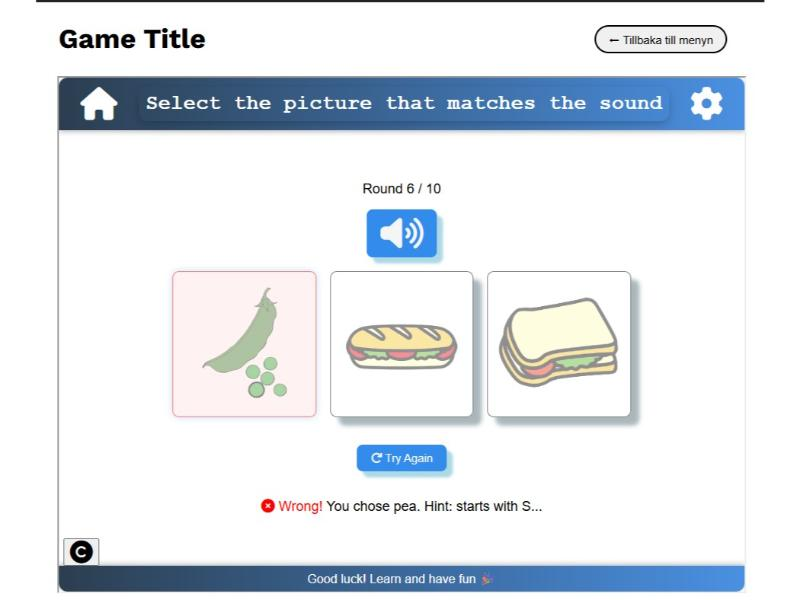 | 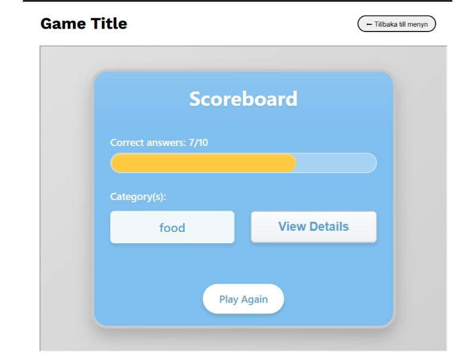 | 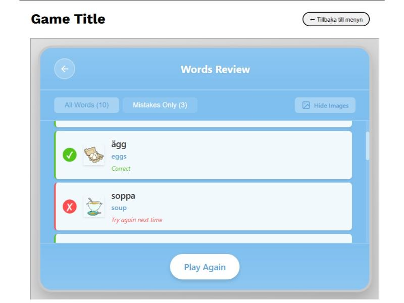 |

---

## ✨ Features

- **Audio-to-image matching**: Listen to Swedish words and select the correct picture.
- **Category-based learning**: Choose topics (e.g., food, transport, animals) to customize your session.
- **Progress tracking**: Review correct/incorrect answers on the end screen.
- **Fully accessible**: Supports keyboard navigation and screen readers.
- **Offline-ready**: Uses local storage for session data.

---

## 🧠 How It Works

### User Flow

1. **Welcome Page** – Quick tutorial for first-time users.
2. **Category Selection** – Pick a vocabulary theme.
3. **Gameplay** – Hear a word, choose the matching image from 4 options.
4. **Results Screen** – See your score and review mistakes.

### ⚒️ Architecture

The app is organized into self-contained component directories, enabling clear separation of concerns.

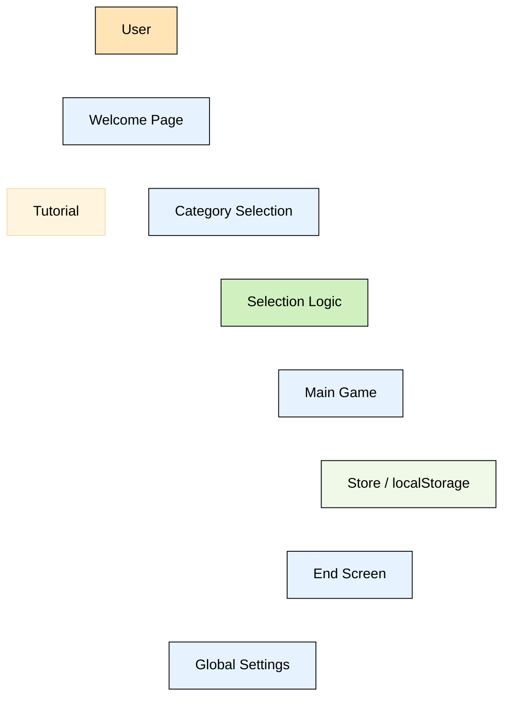

#### 🖼️ Display Components

**Root Directory**

- **Welcome Page**: Introduction and tutorial for new users
- **Select Page**: Category selection menu for customizing learning sessions

**Options Directory**

- **Options Component**: Consistent UI settings interface across all game pages
- Provides uniform user experience for configuration and preferences

**Game Components**

- **Main Game**: Core gameplay loop handling image selection, guess confirmation, and progress tracking
- **End Screen**: Results analysis with filtering capabilities to review correct/incorrect answers and identify areas needing practice

_Summary_

| Directory         | Purpose                                                                              |
| ----------------- | ------------------------------------------------------------------------------------ |
| **Root** (`/`)    | `index.html` (welcome/tutorial) and global assets (`index.css`, `index.js`).         |
| **`options/`**    | Shared settings UI (e.g., reset progress, sound toggle) used across all pages.       |
| **`main_game/`**  | Core gameplay: audio playback, image choices, scoring, and guess validation.         |
| **`end-screen/`** | Results display with filters for correct/incorrect answers and practice suggestions. |

#### ⚙️ Data & Logic Layer

For Data used in the game check the asset folder.

**Store Component**

- API interface for local storage and database operations
- Formats data for easy consumption by other components
- Centralized data management solution

**Selection Component**

- Session management and word randomization
- Controls game progression logic and word selection algorithms
- Extensible design for future complexity enhancements

_Summary_

| Component        | Role                                                                                                                          |
| ---------------- | ----------------------------------------------------------------------------------------------------------------------------- |
| **`selection/`** | Manages session state, category selection, and randomized word delivery. Includes test harness (`SelectionTest.html`).        |
| **`store/`**     | Unified interface for data persistence (currently `localStorage`). Abstracted via `backend_interface/` for future DB support. |

---

## 🛠️ Tech Stack

- **HTML5** + **CSS3** (responsive, semantic markup)
- **Vanilla JavaScript** (ES6+ modules via script organization)
- **Font Awesome** (version 6 for icon and button styling)
- **Web Audio API** for pronunciation playback
- **localStorage** (no additiona storage is used.)
- No build tools — runs directly in the browser!

---

## 🚀 Getting Started

1. Clone or download this repository.
2. Open `index.html` in any modern browser:

   open bash

   ```
   python3 -m http.server 8000
   ```

   It can now be accessed from the browser under: <http://localhost:8000/index.html>

_Alternatively_

Open the project in VScode and install extension `Live Server`.

3. Play through the flow: Game → Catalog Welcome → Select Category → Play → Review Results.

---

## 🧪 Testing

**Current Approach**

Current testing is conducted through an HTML test page in the selection component:

- Enable specific test scripts (e.g.,

  - `store/store.tests.js`→ unit tests for data operations,

  - `selection/SelectionTest.html` → `selection_system_test`)

- Manual testing done by openning the HTML files for each component.
- **Future Improvement**: Migrate to JEST framework for enhanced testing capabilities

### Test Coverage

- ✅**Unit Tests**: Individual function testing for store component
- ✅**Integration Tests**: Cross-function testing within store operations
- ✅**System Tests**: Comprehensive testing of selection component functionality

**Future Needs**: Stress tests (large word sets) and security checks (input validation)

---

## 🤝 Contributing

### Guidelines

We welcome contributions! Please follow these guidelines:

1. **Architecture Compliance**: Follow the established project architecture, keep logic in selection/, UI in main_game/, etc.

`📌 Refer to the D3 hand-in document for detailed architectural rules. `

2. **Licensing**: Ensure all images have traceable licensing information or created by maintainers.
3. **Accessibility**: Maintain keyboard navigation support throughout the application
4. **User Experience**: Prioritize accessible design patterns and consistent visual feedback and design theme.

**Code Quality**

- Refactor JavaScript into small, reusable functions.
- Avoid global variables; use clear module boundaries.
- Comment complex logic (e.g., randomization algorithms).

### Future Development Opportunities

| Priority  | Area                   | Description                                                                |
| --------- | ---------------------- | -------------------------------------------------------------------------- |
| ⚠️ Urgent | Code Modularity        | Refactor JavaScript for better modularity and reusability                  |
| 🔥 High   | Testing Enhancement    | Implement comprehensive stress and security testing                        |
| 🔥 High   | Accessibility          | Fix HTML structure for screen reader compatibility                         |
| 🔥 High   | DB and Image Loading   | Provide animations for loading and make loading faster and less noticeable |
| 🟡 Medium | Progress Visualization | Display player progress metrics within the game interface                  |
| 🟡 Medium | Design Refinement      | Improve visual consistency across all pages                                |
| 🟡 Medium | Documentation          | Create detailed documentation for display components                       |

---

## 📄 License

This project is licensed under ⚖️ the MIT License — see [](https://opensource.org/licenses/MIT).

`🎵 All audio and image assets must be original or openly licensed (e.g., CC0, Unsplash, Freesound).`

---
