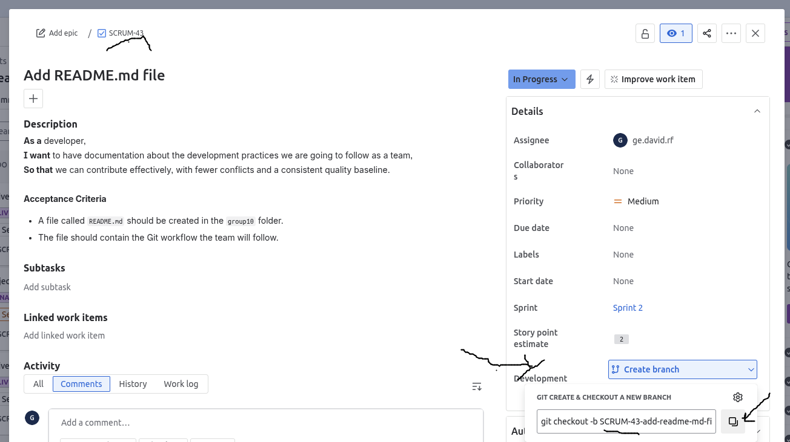

# Development Workflow

All changes to the source code must have a ticket created in Jira. For example:

> **User Story:**  
> As a developer, 
> I want to have documentation about the development practices we are going to follow as a team, 
> so that we can contribute effectively with fewer conflicts and a consistent quality baseline.
>
> **Acceptance Criteria:**
> - A file called README.md should be created in the team10 folder
> - The file should contain the Git workflow the team will follow

## Git Workflow

1. **Clone the repository:**
   ```bash
   git clone git@github.com:uu-semp/swedish-learning-app-2025.git
   ```
   You have successfully cloned the repository to your machine.

2. **Get the latest changes:**
   ```bash
   git pull
   ```
   Ensure you have the latest version of the code locally.

3. **Create a feature branch:**

 


   To get the branch name:
   - Go to Jira and open the ticket you are going to work on
   - Click **Details** > **Development** > **Create branch**
   - Jira will suggest a name based on the title
   - You can modify it, but add `team10/` at the beginning
   - *Note: I will check with Allison to modify the prefix so `team10` is added automatically instead of `SCRUM-`*

   ```bash
   git checkout -b team10/SCRUM-43-add-readme-md-file
   ```
  
4. **Commit your changes:**

   ```bash
   git commit -m "Add README.md with development workflow"
   ```

5. **Push to GitHub:**

   ```bash
   git push
   ```

6. **Create a Pull Request** on GitHub.

7. **Approval required:** At least one approval from any team member is required before merging changes to the main branch.
